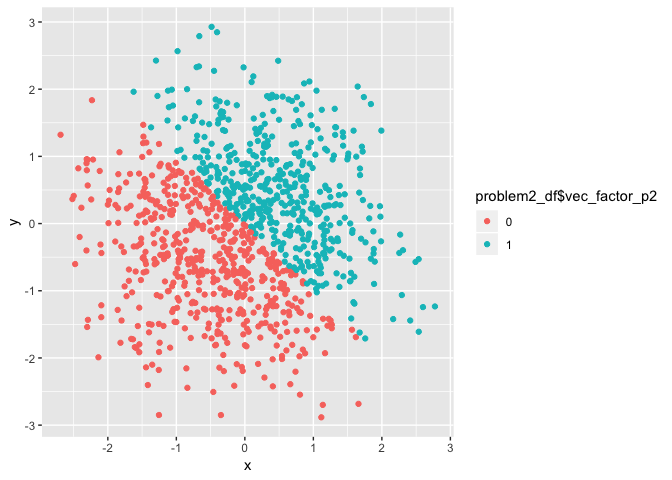

P8105\_hw1\_gwk2111
================
Zach Keefer
9/16/2018

Problem 1
---------

### Creating the Problem 1 Data Frame

First, I will create a data frame for question 1:

``` r
problem1_df = tibble(
  random_sample_p1 = runif(10, 0, 5),
  vec_logical_p1 = random_sample_p1 > 2,
  vec_char_p1 = c("a", "b", "c", "d", "e", "f", "g", "h", "i", "j"),
  vec_factor_p1 = factor(vec_char_p1)
  
)
```

Next, I will take the mean of each of my variables:

``` r
mean(problem1_df$random_sample_p1)
```

    ## [1] 2.710438

``` r
mean(problem1_df$vec_logical_p1)
```

    ## [1] 0.6

``` r
mean(problem1_df$vec_char_p1)
```

    ## Warning in mean.default(problem1_df$vec_char_p1): argument is not numeric
    ## or logical: returning NA

    ## [1] NA

``` r
mean(problem1_df$vec_factor_p1)
```

    ## Warning in mean.default(problem1_df$vec_factor_p1): argument is not numeric
    ## or logical: returning NA

    ## [1] NA

We are only able to calculate the mean of random\_sample and the logic vector. Random\_sample is a numeric variable, so we would expect to be able to calculate the mean. The logic vector is a dichotomous variable that *r* recognizes as either 1 when "TRUE" and 0 when "FALSE", which is why the mean can also be calculated for this variable. The character and factor vectors have character values, and so a mean cannot be calculated because there is no numerical value.

### Converting Variables

Below, I apply the `as.numeric` function to the logical,factor, and character variables:

``` r
as.numeric(problem1_df$vec_logical_p1)

as.numeric(problem1_df$vec_factor_p1)

as.numeric(problem1_df$vec_char_p1)
```

    ## Warning: NAs introduced by coercion

When I apply the `as.numeric` function, the logical vector is converted to 0 or 1 (1 for TRUE and 0 for FALSE). When `as.numeric` is applied to the character vector, we see a warning message that explains NA was introduced by coercion. When `as.numeric` is applied to the factor vector, it is assigned a new number for each new character. They are numbered 1 to 10.

Next I will convert my character variable to a factor variable and then a numeric variable:

``` r
as.numeric(as.factor(problem1_df$vec_char_p1))
```

    ##  [1]  1  2  3  4  5  6  7  8  9 10

My variables are converted to numeric and numbered the same as the factor variable described above.

Finally, I will convert my factor variable to a character variable and then a numeric variable.

``` r
as.numeric(as.character(problem1_df$vec_factor_p1))
```

    ## Warning: NAs introduced by coercion

    ##  [1] NA NA NA NA NA NA NA NA NA NA

I get the same warning message described above. NA is introduced instead of numbers. We are not able to transform character vectors to numeric. As demonstrated above, we would need to convert a character vector to a factor vector before converting it to numeric.

Problem 2
---------

### Create the Problem 2 Data Frame

First, I will create a data frame for question 2:

``` r
problem2_df = tibble(
  x = rnorm(1000),
  y = rnorm(1000),
  vec_logical_p2 = x + y > 0,
  vec_num_p2 = as.numeric(vec_logical_p2),
  vec_factor_p2 = as.factor(vec_num_p2)
)
```

The dataset has 1000 rows and 5 columns. The mean of x is -0.0552284 and the median of x is -0.0269803. The proportion of cases for which the logical vector is true is 0.466.

### Plotting Problem 2

Plot with color points using logical vector:

``` r
ggplot(problem2_df, aes(x = x, y = y, color = problem2_df$vec_logical_p2)) + geom_point()
```


``` r
ggsave("p2_Logic_scatter_plot.pdf", height = 4, width = 6)
```

Plot with color points using numeric vector:

``` r
ggplot(problem2_df, aes(x = x, y = y, color = problem2_df$vec_num_p2)) + geom_point()
```


Plot with color points using factor vector:

``` r
ggplot(problem2_df, aes(x = x, y = y, color = problem2_df$vec_factor_p2)) + geom_point()
```



The color scales for the numeric vector scatter plot is different than the color scale for the factor vector and logical vector plot. While all three vectors only have values of 0 and 1, the numeric scale is a gradient between 0 and 1, while the factor vector and logical vector are dichotomous values with the only possible answers 0 and 1.
